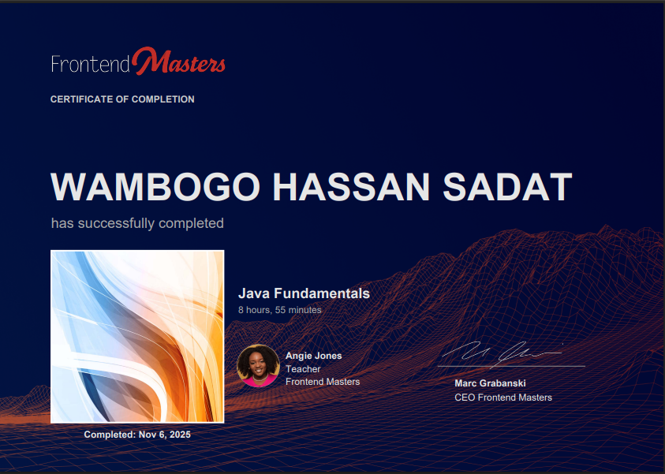
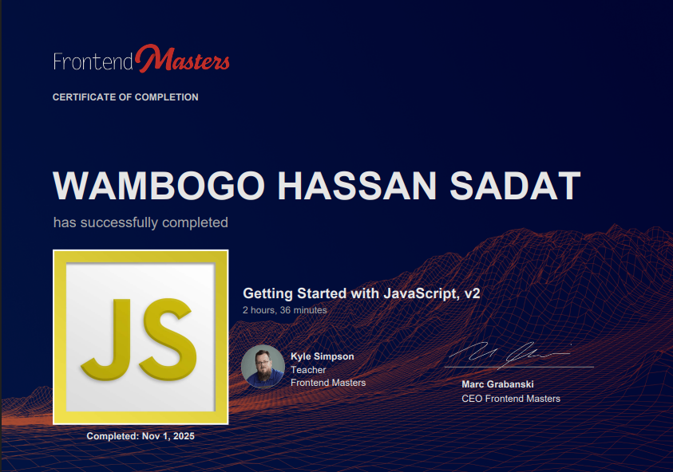
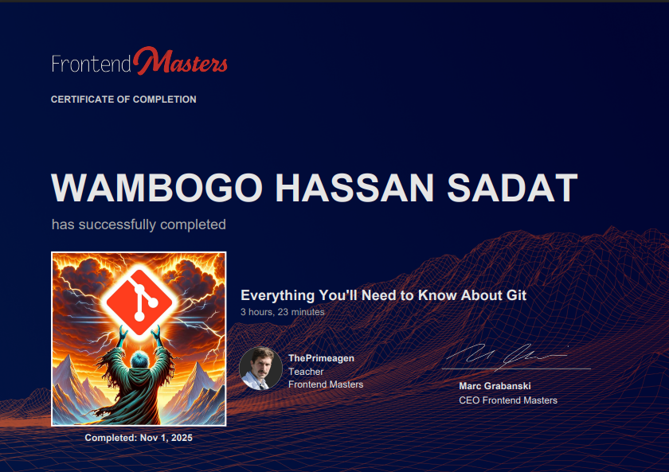

<!-- Wambogo Hassan Sadat BIS-2 2024-2024 -->

<!-- My profile Views -->

<!-- Wambogo Hassan Sadat BIS-24-27 Day Tagline -->
<h1 align="center">
  
</h1>

  
  
  

<!-- About Me -->
## 🧠 About Me

I’m a **passionate MERN Stack Developer** who loves crafting **responsive, dynamic, and futuristic web apps**.  
I blend **creativity with logic** — writing clean, maintainable code while designing stunning user interfaces.

- 🌱 Currently building: **Campus Ballot Voting System (MERN)**
- 💡 Exploring: **Spring Boot APIs & Microservices**
- 🤝 Open to collaborate on: **Innovative MERN or UI/UX projects**
- 🎯 Mission: To craft *visually powerful* & *intelligently structured* web solutions that inspire users.

<!-- My strengths in this system-->
## 💡 Core Strengths
- ⚙️ Full-stack MERN development with scalable architecture  
- 🎨 Futuristic UI/UX thinking (designs that feel alive)  
- 🔐 Secure authentication & multi-role systems  
- 🚀 Real-time dashboards & high-performance apps

## 🚀 My Tech Stack

| Category | Technologies | Icons |
| :--- | :--- | :--- |
| **📚 Tech Stack** | MongoDB, Express.js, React, Node.js |  |
| **🌐 Frontend** | HTML5, CSS3, JavaScript, React, Bootstrap |  |
| **⚙️ Backend** | Java, Node.js, Express.js, MongoDB, SQLite |  |
| **🛠️ Tools** | Git, Github, VS Code, Vercel, Netlify, Render |  |
| **🎨 Design** | Figma, Adobe Photoshop, Adobe Illustrator, Adobe XD, Webflow |  |

<!-- What am currently Learning -->

## 🚧 Currently Learning

Expanding my full-stack toolkit with new frameworks and backend expertise:

  

- ⚙️ Building RESTful APIs with **Spring Boot**
- 🔐 Strengthening **Security & Auth Systems**
- ⚡ State Management: **Redux** & **Vuex**

<!--M projects -->
## 🧩 Featured Projects

| 🌐 Project | ⚙️ Description | 🚀 Stack |
|-------------|----------------|-----------|
| [Campus Ballot](https://www.campusballot.tech) | Secure online voting platform with real-time stats | MERN, JWT, Brevo, Bootstrap, MySQL |
| [Campus Alert System](https://github.com/Chemistry2i) | Class alerts & notifications system | MERN Stack |
| [Portfolio Website](https://wambogohassansadat.dev) | Personal futuristic portfolio | HTML, CSS, JS, FontAwesome |
| [Agricultural System](https://agri-buddy.onrender.com/) | Role-based Agricultural dashboard | React, Node.js, MongoDB |
| [Sacco Management System](https://github.com/Chemistry2i) | Role-based financial dashboard | React, Node.js, MongoDB |
| [RoomLink_UG](https://github.com/Chemistry2i) | Role-based Hostel Management System | React, Node.js, Express, MongoDB, JWT |

<!-- My Achievements-->
## 🏆 Achievements & Highlights

- 🥇 **Top 50 Committers (Uganda)** 
- 🏅 **Wakatime Leaderboard (Uganda)** - [Rank 10](https://wakatime.com/leaders?page=1&country_code=UG)
- 🚀 Contributed to multiple **open-source MERN projects**
- 🎨 Designed **UI systems for futuristic dashboards**
- 📚 Built **multi-role authentication systems**
- 💬 Backend developer at **Peculiar Technologies**

<!-- github insights-->
## 📊 GitHub Insights

|  |  |
|---|---|

## 🔥 GitHub Streaks & Trophies

  

  

## ⏱️ Coding Activity (WakaTime)

  

## 🎓 Certifications
<!-- My Certificates since -->
Here are some of the certifications that strengthened my skills in frontend engineering, backend development, and professional development:

<table>
  <tr>
    <th></th>
    <th></th>
    <th></th>
  </tr>
  <tr>
    <td align="left">- <b>Node.js</b> - <b>Express.js</b> - <b>Claude AI</b></td>
    <td align="left">- <b>JavaScript Deep Dive</b> - <b>Java Fundamentals</b> - <b>Version Control with Git</b></td>
    <td align="left">- <b>JavaScript Essentials 1</b> - <b>JavaScript Essentials 2</b> - <b>Green House Accounting</b> - <b>IT Customer Support Basics</b> - <b>CSS, Bootstrap</b> - <b>HTML</b></td>
  </tr>
</table>

---

### 📜 Certificate Badges (Visual Version)

  
  
  

---

### 📁 Certificate Gallery

  
  
  

<!-- My philosophy -->
## 💬 Fun Facts

- ⚡ I design dashboards that *feel alive* ✨  
- 🧠 My philosophy: “Clean UI + Solid Logic = Perfection”  
- 🧩 I enjoy code refactoring, animation, and creative design  
- 🎮 When not coding, I explore futuristic tech concepts  and playing Videos

## 🌌 My Vision

> “To merge design intelligence and code precision into future-ready digital systems.”

## 💡 Philosophy
> "I believe great design is invisible — it simply *feels right*."

## 🌐 Let's Connect

  
  
  
  

## 🧬 Contribution Snake

  

  <b style="color:#00FFFF;">💡 Let’s build the future — one line of code at a time.</b>

 

<!-- 
  Wambogo Hassan Sadat 
  Kyambogo University
  Bachelor's in Information Systems
  Web Developer && System Analyst
  Duration : 3 years from 2024 - 2027
  Web Lead Kyucsa
  Junior Developer at Peculiar Technologies 
-->

